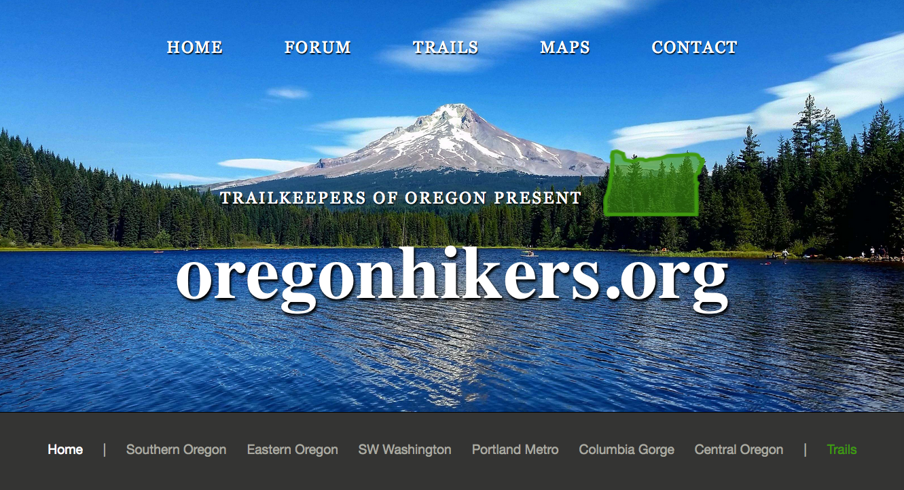

# Oregon Hikers ReDesign #

### Please check it out live on gh-pages: https://d34n5.github.io/oregon-hikers ###

## Web App ReDesign made with HTML, CSS, Sass & Flexbox ##

### Week 5 CSS Independent Project by Dean Scelza @ Epicodus, 12-23-16 ###

#### Description & Technologies Used ####
Built with HTML, CSS3, Sass and Flexbox.
Focus on Sass nesting, variables and media queries.

### Installation & Set-Up ###
1. Clone the repository: https://github.com/d34n5/oregon-hikers
2. Use your preferred browser to open index.html

#### Known Bugs ####
There are no known bugs.  However, I encourage both feedback and criticism: If you have ANY concerns, questions or suggestions, feel free to contact me at:  deanscelza@gmail.com

## License ##
**Copyright (c) 2016, Dean Scelza @ Epicodus**
This software is licensed under the MIT license.
